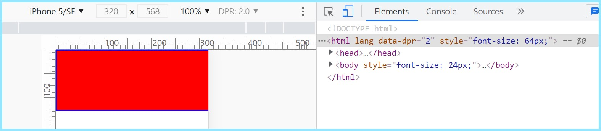

# 初始化项目
1、利用vue-cli初始化项目
2、配置lib-flexible，这个插件的作用是会根据dpr进行适配
3、配置postcss-px2rem，这个插件的作用是自动将px单位转换成rem单位
4、配置vant（轻量、可靠的移动端 Vue 组件库，这个项目需要用到这里面的内容）

## 配置
### 1、配置lib-flexible
[https://github.com/amfe/lib-flexible/blob/master/src/flexible.js](https://github.com/amfe/lib-flexible/blob/master/src/flexible.js)
- 具体步骤参考如下：
```node
  //第一步：node环境下
   npm install lib-flexible -S
//这里的-S的意思即--save（保存）
//包名会被注册在package.json的dependencies里面，在生产环境下这个包的依赖依然存在
```
```js
   //第二步：main.js
    import 'lib-flexible';
  //如果成功使用了这个插件，那么在页面的html标签处会多一个data-dpr属性
```
- 为什么应用成功这个插件了，更改了dpr的值，页面中的html标签的data-dpr的值却不变？
  >因为创建vue项目的时候，模板中有meta标签，这个插件默认如果有这个标签，即```content="width=device-width,initial-scale=1.0"```，那么即使应用了插件也不走默认适配的js文件
- 除了选择responsive，其他手机的尺寸试试
- 更改不同的移动设备尺寸，得到不同的dpr，dpr和html标签内的font-size属性是怎么计算的：fontSize=width/10*dpr
 

[要了解-S表示什么点这里](https://www.cnblogs.com/web-record/p/10904907.html)
### 2、配置px2rem
[https://www.npmjs.com/package/postcss-px2rem](https://www.npmjs.com/package/postcss-px2rem)
```js
//*vue.config.js
const px2rem = require('postcss-px2rem');

module.exports = {
  css: {
    loaderOptions: {
      postcss: {
        plugins: [
          px2rem({
            remUnit: 75//写了这个值，代表的就是1个rem的值
          }),
        ],
      },
    },
  },
};

```
```css
/* App.vue */
#app {
  width: 375px;
  /* 这里设置了375的值,那么就会根据上面的remUnit进行运算,75px就是刚好一半,无论在哪个dpr下都是一半 */
  height: 250px;
  border: 5px solid blue;
  background-color: red;
}
```
### 3、配置vant
[https://youzan.github.io/vant/#/zh-CN/quickstart](https://youzan.github.io/vant/#/zh-CN/quickstart)
>第一步:安装vant
```node
npm i vant -S
```
>第二步:导入vant
```js
//main.js
import Vue from "vue";
import Vant from 'vant';
import 'vant/lib/index.css';
Vue.use(Vant);
```